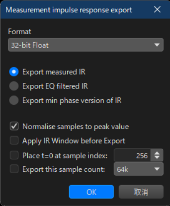

# drc-wrapper

Simple bash script which generates convolution filters for your stereo speakers with drc (DRC-FIR).

## Prerequisites

drc and sox executables must be in your PATH.
We tested the script with [drc 3.2.3](https://sourceforge.net/projects/drc-fir/files/drc-fir/3.2.3/) and [sox v14.4.2](https://sourceforge.net/projects/sox/files/sox/14.4.2/) on Windows Git Bash.

To create convolution filters for a system using a sample rate other than 44.1 Khz, you'll also need a drc configuration file for 48.0 Khz impulse response files (Such as one from [align2](https://www.ohl.to/about-audio/audio-softwares/align2)).

## Usage

### 1. Prepare impulse response WAV files

Measure your left and right speaker separately with REW, then export the impulse responses with "Export all impulse responses as WAV".



### 2. Extract PCM data from impulse response WAV files

Replace `/path-to-rew-exports/[left|right]-speaker-impulse-response.wav` with the file name you exported impulse responses to.

```bash
sox /path-to-rew-exports/left-speaker-impulse-response.wav -t f32 ./tmp/left-speaker-impulse-response.pcm
sox /path-to-rew-exports/right-speaker-impulse-response.wav -t f32 ./tmp/right-speaker-impulse-response.pcm
```

### 3. Create a config file for drc-wrapper

Copy the sample config file (which contains drc arguments on each line) to any directory you prefer and modify it to suit your needs.

```bash
mkdir ~/.drc-wrapper/
cp drc-args-sample.txt ~/.drc-wrapper/drc-args.txt
```

You'll at least need to edit the following arguments:

#### MCPointsFile

Path to calibration file for your microphone, which contains frequency and SPL offset value on each line.
The first line must be the SPL offset value for 0 Hz and the last line is for 22000 Hz, otherwise drc fails to load the file.

See [MCPointsFile documentation on DIR-FIC Website](https://drc-fir.sourceforge.net/doc/drc.html#sec74) for more details.

#### PSPointsFile

The target curve of your speakers. DRC tries to make frequency response close to the curve as possible by applying filters.

We created [a sample target curve file](./target-curve-sample.txt) which I derived from [B&K Curve from DRC Designer](https://github.com/aljordan/DRCDesignerWindows/blob/d3feaaeb7cc46f1aedae5e93a0af84a9d38887b6/DRCDesigner/src/org/alanjordan/drcdesigner/Targets.java#L123-L133s) and [Harman Target Curve](https://www.audiosciencereview.com/forum/index.php?threads/a-collection-of-speaker-target-responses-in-csv-txt-format.16401/), which you could use as a starting point.

See [PSPointsFile documentation on DIR-FIC Website](https://drc-fir.sourceforge.net/doc/drc.html#sec216) for more details.

#### base drc config file

Change `/path/to/align2/files/drc/48.0KHz/minimal-48.0.drc` to whichever drc config file you prefer.

See [this section on drc documentation](https://drc-fir.sourceforge.net/doc/drc.html#sec49) for info on choosing a config file.

## 4. Create a convolution filter WAV file

Change the current directory to this repo and run the script with the following format:

```bash
./drc-wrapper.sh <config_file> <sample_rate> <out_file>
```

For example, to create a filter from 48Khz impulse responses using the config file you created in the previous step, run the following command.
Replace `/path/to/convolver-filters/` part with the directory you'd like to export a filter to.

```bash
./drc-wrapper.sh ~/.drc-wrapper/drc-args.txt 48000 /path/to/convolver-filters/convolver-filter.wav
```
